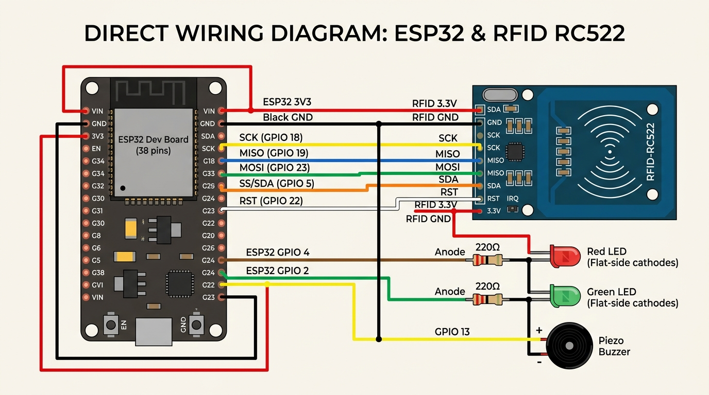

# 📡 دليل تشغيل جهاز استدعاء الطلاب بالبطاقة الذكية RFID (ESP32 + RC522)

هذا الدليل يشرح كيفية توصيل وبرمجة جهاز الاستدعاء الإلكتروني الميداني لبوابة المدرسة باستخدام شريحة **ESP32** وقارئ البطاقات الذكية **RC522**، مع مؤشرات ضوئية (ليد أخضر وأحمر) وتنبيه صوتي (Buzzer) ثلاثي النغمات.

---

## 📦 القطع المستخدمة (Hardware Components)

1. **لوحة ESP32 Development Board** (30 أو 38 دبوس).
2. **قارئ بطاقات RFID RC522** (Mifare 13.56MHz IC Card Sensor).
3. **جرس تنبيه (Buzzer)**.
4. **ليد أخضر (Green LED)**.
5. **ليد أحمر (Red LED)**.
6. **أسلاك توصيل جمبر ميل تو فيميل (Male-to-Female Jumper Wires)**.

---

## 🚦 منطق الإضاءة والأصوات (System Feedback)

| الحالة | الإضاءة | درجة الصوت (Buzzer) | التفسير |
| :--- | :---: | :---: | :--- |
| **قبول طلب الاستدعاء** | 🟢 **أخضر** | نغمتان تصاعديتان مبهجتان (درجة النجاح) | تم تسجيل الاستدعاء بنجاح وسيظهر فوراً لشاشة المعلم |
| **تم الاستدعاء مسبقاً** | 🔴 **أحمر** | 3 رنات تنبيهية متتالية متوسطة النبرة | الطالب تم استدعاؤه مسبقاً اليوم لمنع التكرار |
| **لم ينجح / غير مسجل** | 🔴 **أحمر** | نغمة طويلة منخفضة وغليظة (درجة الفشل) | البطاقة غير معرفة لأي طالب أو يوجد خطأ بالسيرفر |

---

## 🔌 خطوات تركيب الأسلاك (طريقة التوصيل بالتفصيل)



### 💡 التوصيل المباشر بدون لوحة تجارب (بدون Breadboard):
إذا لم تكن تمتلك لوحة تجارب (Breadboard)، يمكنك التوصيل المباشر بالسلك:
- **جهة لوحة ESP32:** الطرف الأنثى (Female) من سلكك الممدد يركب مباشرة على دبابيس الـ ESP32 البارزة.
- **جهة الليدات والجرس:** يمكنك إدخال الأرجل المعدنية لليدين والجرس مباشرة داخل فتحة السلك الأنثى، أو لفها حول الدبوس الذكر وتثبيتها بشريط لاصق عازل (شكرتون).
- **توزيع الأرضي السالب (GND):** لوحة ESP32 تحتوي على 2 إلى 3 منافذ GND موزعة على جانبي اللوحة يمكنك استخدامها، أو يمكنك جمع وتوصيل الأرجل السالبة لليد الأخضر والأحمر معاً في خط سالب واحد.

---

### 1️⃣ توصيل قارئ البطاقات (RC522) مع ESP32:

> ⚠️ **تحذير هام جداً:** منفذ الطاقة `3.3V` في RC522 يجب توصيله فقط بمنفذ `3V3` في ESP32. **لا تقم بتوصيله بمنفذ 5V أو VIN نهائياً** حتى لا تتلف الشريحة!

| طرف قارئ RC522 | منفذ ESP32 Dev Board | وظيفة الخط |
| :--- | :--- | :--- |
| **SDA (أو SS)** | **GPIO 5** | اختيار الشريحة (SPI Slave Select) |
| **SCK** | **GPIO 18** | خط توقيت النبضات (SPI Clock) |
| **MOSI** | **GPIO 23** | إرسال البيانات (Master Out Slave In) |
| **MISO** | **GPIO 19** | استقبال البيانات (Master In Slave Out) |
| **IRQ** | *اتركه فارغاً (غير متصل)* | غير مطلوب |
| **GND** | **GND** | خط التأريض السالب |
| **RST** | **GPIO 22** | إعادة التعيين (Reset) |
| **3.3V** | **3V3** (3.3V) | مصدر الطاقة 3.3 فولت فقط |

---

### 2️⃣ توصيل جرس التنبيه (Buzzer):

- **الطرف الموجب (+)** [الرجل الطويلة أو التي عليها علامة +] ⬅️ يوصل بمنفذ **GPIO 4**.
- **الطرف السالب (-)** [الرجل القصيرة أو التي عليها علامة -] ⬅️ يوصل بمنفذ **GND**.

---

### 3️⃣ توصيل الإضاءة (LEDs):

#### 🟢 الليد الأخضر (قبول الاستدعاء):
- **الطرف الموجب (Anode - الرجل الأطول)** ⬅️ يوصل بمنفذ **GPIO 2** (يفضل وضع مقاومة 220Ω لحمايته إن توفرت).
- **الطرف السالب (Cathode - الرجل الأقصر)** ⬅️ يوصل بمنفذ **GND**.

#### 🔴 الليد الأحمر (غير مسجل أو تم الاستدعاء مسبقاً):
- **الطرف الموجب (Anode - الرجل الأطول)** ⬅️ يوصل بمنفذ **GPIO 15** (يفضل وضع مقاومة 220Ω لحمايته إن توفرت).
- **الطرف السالب (Cathode - الرجل الأقصر)** ⬅️ يوصل بمنفذ **GND**.

> 💡 **ملاحظة بخصوص منافذ الأرضي (GND):**  
> لوحة ESP32 تحتوي عادة على 2 إلى 3 منافذ GND. نظراً لوجود 4 قطع تحتاج GND (القارئ، الجرس، الليدين):  
> يمكنك جمع الأسلاك السالبة معاً أو شبكها في خط أرضي مشترك، أو استخدام لوحة تجارب صغيرة (Breadboard).

---

## 💻 خطوات رفع الكود على ESP32 (Arduino IDE)

1. افتح برنامج **Arduino IDE** على جهازك.
2. ثبّت حزمة لوحات ESP32 (من `Tools` -> `Board Manager` وابحث عن `esp32` من Espressif).
3. ثبّت المكتبات المطلوبة من `Sketch` -> `Include Library` -> `Manage Libraries`:
   - **`MFRC522`** (بواسطة GithubCommunity أو Miguel Balboa).
   - **`ArduinoJson`** (بواسطة Benoit Blanchon - يدعم الإصدار 6 و 7).
4. افتح ملف الكود من المشروع:
   [`firmware/esp32_rc522/esp32_rc522_caller.ino`](file:///c:/Users/LENOVO/Desktop/STU/firmware/esp32_rc522/esp32_rc522_caller.ino)
5. قم بتعديل إعدادات الاتصال في أعلى الملف:
   ```cpp
   const char* WIFI_SSID     = "اسم_شبكة_الواي_فاي";
   const char* WIFI_PASSWORD = "كلمة_مرور_الواي_فاي";
   
   // رابط السيرفر الخاص بنظامك (يدعم HTTP و HTTPS على Coolify مباشرة)
   const char* SERVER_URL    = "https://your-domain.com/api/rfid_call.php";
   ```
6. من قائمة `Tools` اختر:
   - **Board:** `ESP32 Dev Module` (أو نوع لوحتك الدقيق).
   - **Port:** اختر منفذ الـ COM الخاص بقطعة الـ ESP32 الموصلة بالكمبيوتر.
7. اضغط على زر **Upload** (السهم المتجه لليمين) لبرمجة القطعة.
8. افتح **Serial Monitor** على سرعة `115200 Baud` لمتابعة بدء التشغيل واتصال الواي فاي وعمليات المسح.

---

## 🏷️ كيفية ربط بطاقة RFID بطالب في النظام

1. ادخل إلى لوحة تحكم الإدارة: `/admin/`.
2. انتقل إلى **إدارة الطلاب**.
3. أمامك طريقتان للربط:
   - **الطريقة السريعة:** اضغط على زر **"📡 ربط بطاقات RFID"** بأعلى الصفحة، اختر اسم الطالب، ثم مرر البطاقة أو اكتب كودها واضغط حفظ.
   - **الطريقة اليدوية:** اضغط زر تعديل (✏️) بجانب أي طالب، وأدخل كود البطاقة (UID) في خانة **"بطاقة RFID الذكية"**.

---

## 🧪 اختبار الاستدعاء (API Endpoint Test)

يمكنك فحص استجابة السيرفر في أي وقت باستخدام أداة `cURL` أو المتصفح:
```bash
curl -X POST "https://your-domain.com/api/rfid_call.php" \
     -H "Content-Type: application/json" \
     -d '{"card_uid": "A1B2C3D4", "device_id": "بوابة 1"}'
```
